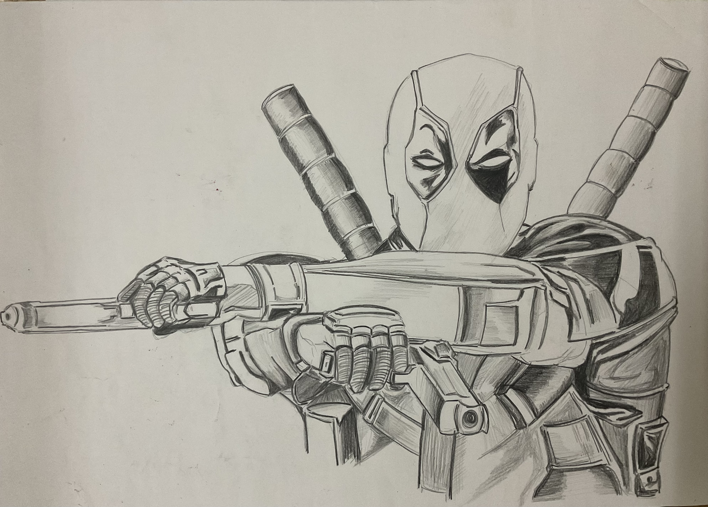

I've been doing this since my school days, but I lost a lot of my artworks that I had done before undergrad (╥_╥). Recently I have shifted to digital medium, and trying to improve my coloring skills (was never good at that). 
But so far I have only tried to imitate things, and I find it challenging to draw something original. I hope to improve on that as well :) 

")

*")

